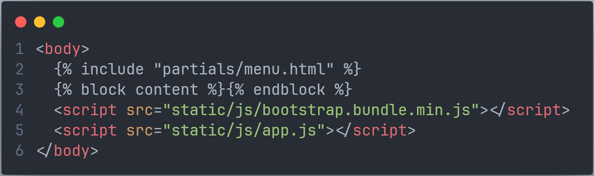
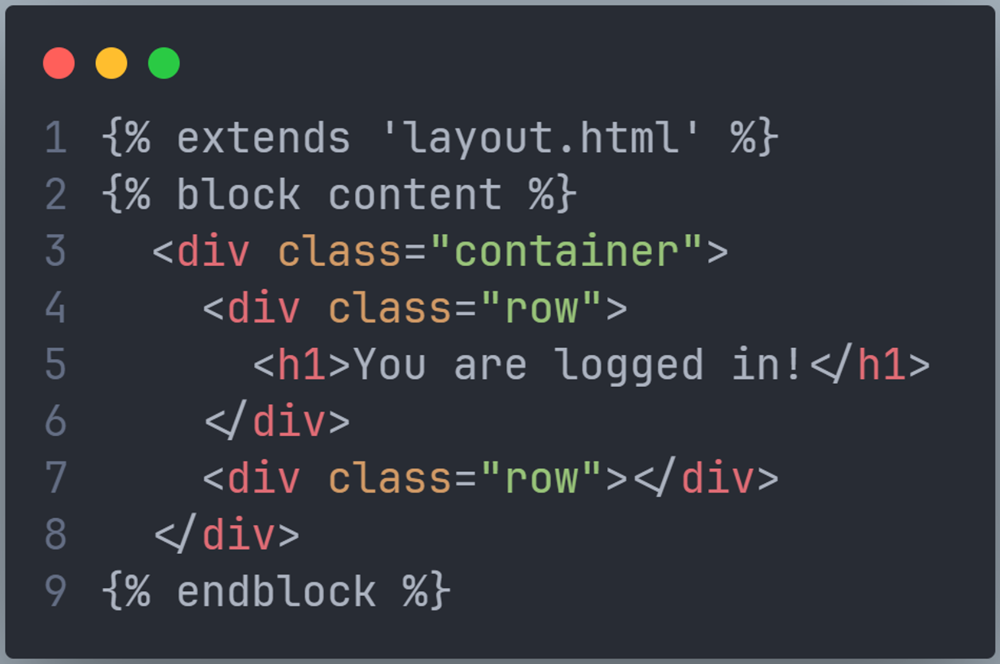
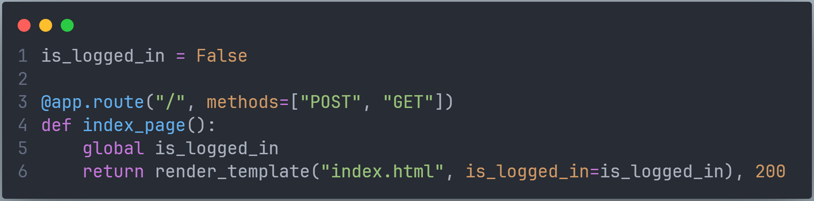
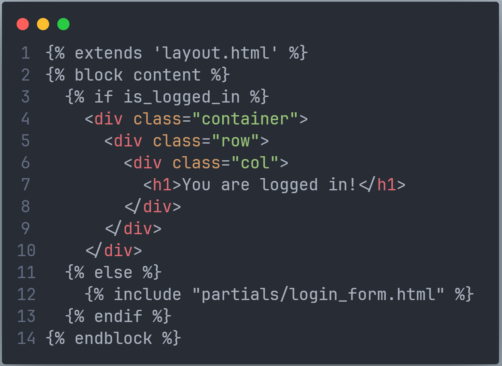
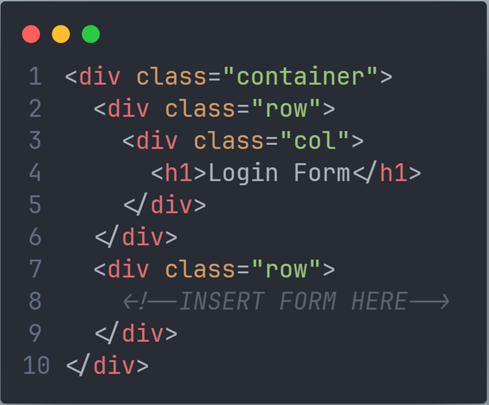
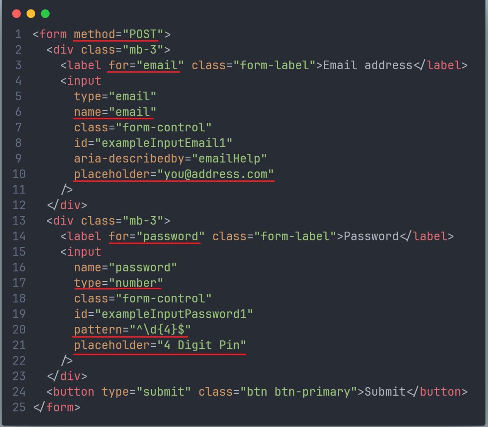
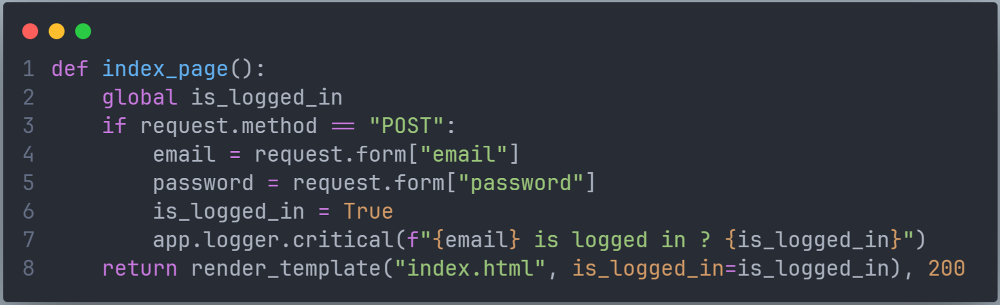
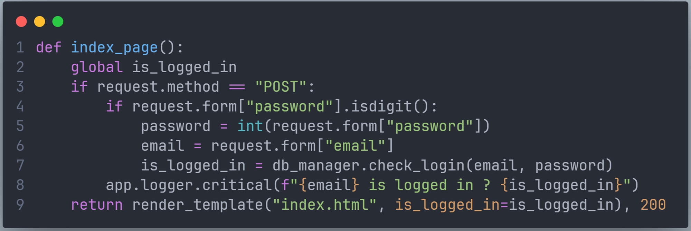
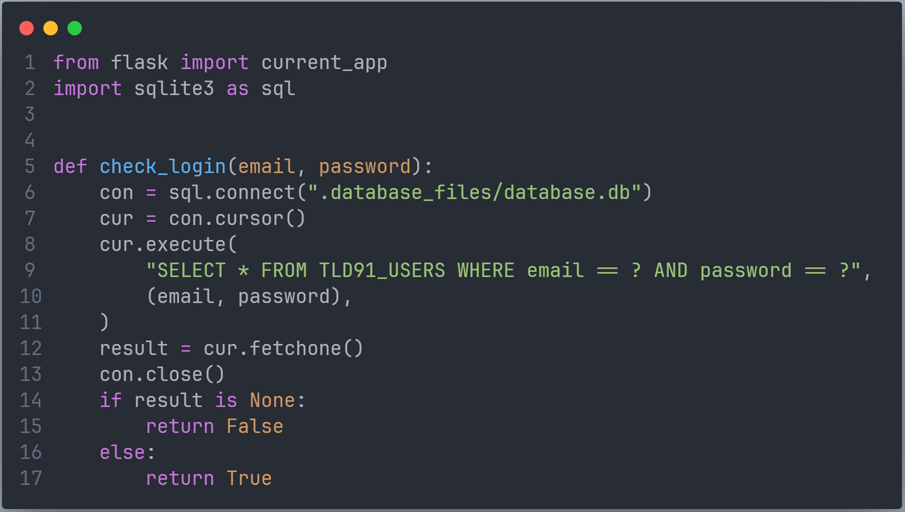

#  Basic Unsecure PWA
Based on https://github.com/TempeHS/Practical_Approach_to_Secure_Software_Architecture_Resources/tree/Tue_10th_Dec_2024

## Create your own copy
* On GitHub create a fork of the Unsecure_PWA repository
https://github.com/khs-stevenson/Unsecure_PWA

* Clone the new repository to your local computer, then open it in VS Code.


## File Folder Structure

```text
├── database_files
│ └── database.db
├── static
│ └── #PWA static files & folders
├── templates
│ ├── partials
│ │ ├── login_form.html
│ │ └── menu.html
│ ├── index.html
│ └── layout.html
├── db_interface.py
└── main.py
```

## Important links

- [Bootstrap Core](https://getbootstrap.com/docs/5.3/getting-started/introduction/)
- [Bootstrap Navbar](https://getbootstrap.com/docs/5.3/components/navbar/)
- [Bootstrap Forms](https://getbootstrap.com/docs/5.3/forms/overview/)

## Instruction
Read these in conjunction with the _working_documents/instructions.pptx  

### 1. Run main.py
Without making any modifications, execute the main.py file.   
In VS Code, open the terminal by right-clicking main.py and selecting "Open in Integrated Terminal".   
Type 'python main.py' in the terminal.   
Navigate to http://127.0.0.1:5000/   
### 2. Install any necessary extensions
If the program did not run, then it is probably missing extensions. The list of required extensions is in requirements.txt.   
The easiest way to install the requirement is to enter the following in the terminal:  
    <i>pip install -r requirements.txt </i>  
Then repeat step 1. 

### 3. Add Jinga2 to layout.html
Rename the index.html to layout.html   
Change the ```<body>``` to add the Jinga2 partials and block content  


### 4. Create new index.html 
Create a new index.html  
Add the following to that file.  


### 5. Add a Nav bar
This will be just the default values to show how it can be done.  

Create partials/menu.html  
Copy and paste into menu.html the basic navbar from https://getbootstrap.com/docs/5.3/components/navbar/  

### 6. Is_logged_in Boolean
Add a Boolean to manage logged in/out state. 
Pass the Boolean to the index.html template.  


### 7. Add Jinga2 logic to index.html


### 8. partials/login_form.html
Create a new file partials/login_form.html 
Add the basic html code as shown.  
   
Add to the form the first login script on https://getbootstrap.com/docs/5.3/forms/overview/  
Modify the form code so that it matches the following, paying close attention to the underlined sections.
  

### 9. extend index_page()
Extend the index_page() method in main.py to store the form data as variables.  
Log them to the terminal for debugging purposes.  
   

### 10. Add database access
In main.py, add   
<i>import db_interface as db_manager</i>  
at the start of the program.
   
Then add the call to the db_manager to authenticate the email and password. A valid email/password is me@here.com/1234   

   

### 11. Create db_manager.py
Create a new file in the same folder as main.py called db_manager.py   
Add the following code to that file.

  
